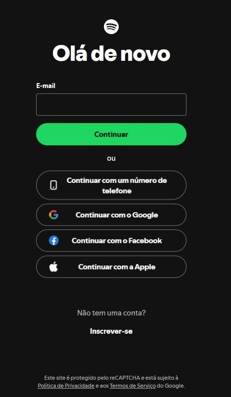
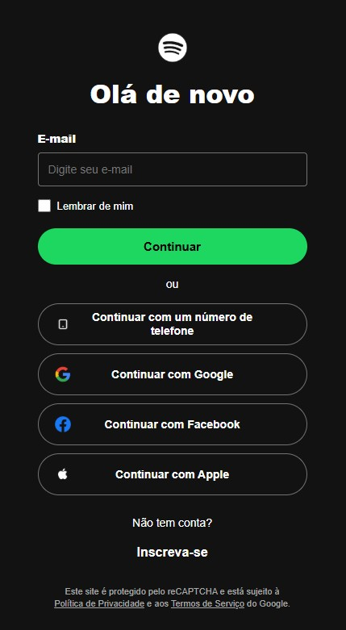

# Clone do Spotify – Tela de Login

## 👤 Identificação

- **Disciplina:** Front-End
- **Professor:** Matheus Henrique Barquette
- **Estudante:** Endrewell Vinicius Favaretto
- **Matrícula:** 1139685
- **Site de referência:** [Spotify – Login](https://accounts.spotify.com/pt-BR/login)

---

## 📸 Comparação Visual

| Site Original (Spotify) | Clone Desenvolvido |
| :---: | :---: |
|  |  |

---

## ✅ Checklist de Requisitos (Parte 1)

- [x] **1.1** Estrutura HTML semântica e acessível
- [x] **1.2** Fidelidade visual à referência
- [x] **1.3** CSS: seletores, box model e variáveis
- [x] **1.4** Responsividade: Flexbox e mobile first
- [x] **1.5** Personalização e originalidade

---

## 📝 Justificativas e Explicações (Parte 1)

### 1.1 Estrutura HTML semântica e acessível

**Tags semânticas utilizadas**

- `<header>`: agrupa o título principal da página (`<h1>` "Olá de novo").
- `<main>`: contém o conteúdo principal, ou seja, o formulário de e-mail, o separador "ou", os botões de login alternativos e a chamada para cadastro.
- `<form>`: bloco de autenticação, com o campo de e-mail, a opção "Lembrar de mim" e o botão "Continuar".
- `<footer class="rodape">`: aviso do reCAPTCHA com os links de Política de Privacidade e Termos de Serviço.
- O logo (``) fica no início do `<body>`, antes do `<header>`. Por isso ele é estilizado com o seletor `body > img`.

**Tags que não foram usadas e por quê**

`<nav>`, `<section>` e `<article>` não foram usadas porque a tela de login não tem menu de navegação, seções temáticas nem conteúdo independente. Usar essas tags sem necessidade iria contra a semântica correta.

**Atributos `alt`**

Todas as imagens têm `alt` descritivo: `alt="Logo Spotify"` no logo e `alt="Telefone"`, `alt="Google"`, `alt="Facebook"` e `alt="Apple"` nos ícones dos botões de login. Cada ícone está ao lado de um texto visível, então o `alt` só identifica o que a imagem representa para leitores de tela.

**Formulário acessível**

- O campo de e-mail tem um `<label>` associado por `for="text"` e `id="text"`.
- A caixa "Lembrar de mim" também tem `<label for="lembrar">` associado ao `id="lembrar"`.
- O campo usa `required` e `placeholder`, e a mensagem de erro ("Informe seu endereço de e-mail.") é exibida apenas depois que o usuário interage com o campo, usando a pseudo-classe `:user-invalid`.
- O `<form>` usa `novalidate` para que a validação visual seja controlada pelo CSS, e `action="#"` porque o trabalho é só de front-end, sem back-end. Os botões de login alternativos e "Inscreva-se" usam `onclick="location.reload()"` para simular a navegação.

**Análise da página original**

Na página original, o cabeçalho traz o logo e o título de boas-vindas. A área principal concentra o formulário com o campo de e-mail (que tem um rótulo visível "E-mail" e uma mensagem de erro quando fica vazio), seguido dos botões de login com telefone, Google, Facebook e Apple e do link de cadastro. O rodapé mostra o aviso do reCAPTCHA. O clone reproduz essa mesma organização (cabeçalho, conteúdo e rodapé) usando as tags semânticas correspondentes.

---

### 1.2 Fidelidade visual à referência

A reprodução buscou a máxima proximidade com a tela de login real:

- **Cores:** fundo escuro (`#121212`), verde do Spotify (`#1ed760`) e seu hover (`#1fdf64`), cinza da borda dos campos (`#727272`), cinza dos textos auxiliares (`#a7a7a7`) e vermelho de erro (`#e22134`).
- **Proporções e espaçamentos:** formulário centralizado com largura máxima de `320px` no celular e `334px` no desktop, botões com cantos totalmente arredondados (`border-radius: 50px`) e altura mínima de `52px` nos botões de login alternativos.
- **Organização:** logo, título, formulário, separador "ou", botões alternativos, chamada para cadastro e rodapé, na mesma ordem da página original.

**Diferenças justificadas**

- **Fonte:** o Spotify usa uma fonte própria (Circular), que é proprietária. No clone foi usada `Arial, Helvetica, sans-serif`, uma fonte sem serifa equivalente e disponível em qualquer dispositivo.
- **Campo de e-mail:** foi usado `type="text"` em vez de `type="email"` para que a mensagem de erro seja totalmente controlada pelo CSS, sem a mensagem padrão do navegador.

---

### 1.3 CSS: seletores, box model e variáveis

O arquivo `style.css` foi organizado com os seguintes recursos:

- **Variáveis CSS (`:root`):** `--bg-color`, `--text-color`, `--primary-green`, `--primary-green-hover`, `--border-color`, `--error-color` e `--text-muted`, usadas com `var()` em todo o arquivo.
- **Variedade de seletores:**
  - *Universal:* `*` (reset de `margin`, `padding` e `box-sizing`).
  - *Classe:* `.btn-social`, `.mensagem-erro`, `.opcao-lembrar`, `.icone`, `.btn-inscrever`, `.rodape`.
  - *Descendente:* `header h1`, `.opcao-lembrar label`, `.rodape p`, `.rodape a`.
  - *Filho direto:* `body > img`, `main > p`.
  - *Irmão adjacente:* `input[type="text"]:user-invalid + .mensagem-erro`.
  - *Atributo:* `input[type="text"]`, `form button[type="submit"]`, `.icone[alt="Apple"]`.
  - *Pseudo-classe:* `:hover` e `:user-invalid`.
- **Box model:** `box-sizing: border-box` aplicado a todos os elementos, além do uso de `padding`, `border`, `margin` e `max-width` para controlar o tamanho dos campos e botões.
- **Cascata e especificidade:** `.icone[alt="Apple"]` sobrescreve o tamanho e a posição definidos em `.icone`, porque tem maior especificidade.
- **Unidades:** `px`, `%` (larguras) e `vh` (altura mínima da tela, com `min-height: 100vh`).

---

### 1.4 Responsividade: Flexbox e mobile first

- **Mobile first:** o CSS base foi escrito para telas de celular e funciona sem nenhuma media query.
- **Flexbox:** usado em `body`, `main`, `form`, `.opcao-lembrar` e `.btn-social` para alinhar os elementos na vertical e na horizontal.
- **Media query:** `@media (min-width: 768px)` aumenta o espaçamento superior da página (`padding-top: 48px`) e a largura máxima do conteúdo (`max-width: 334px`) em telas maiores.
- **Testes:** o layout foi verificado tanto em tamanho de celular quanto em tela de desktop.

---

### 1.5 Personalização e originalidade

Foi implementada a opção **"Lembrar de mim"** (`<div class="opcao-lembrar">`), a personalização que adicionei ao clone:

- **HTML:** um `<input type="checkbox" id="lembrar">` com `<label for="lembrar">` associado, dentro de uma `<div>` própria.
- **CSS:** a caixa de seleção foi estilizada na cor verde do Spotify com `accent-color: var(--primary-green)`, e o conjunto usa Flexbox (`display: flex`, `align-items: center`, `gap: 8px`) para alinhar a caixa ao texto. O rótulo e o cursor foram ajustados em `.opcao-lembrar label`.
- **Funcionamento:** é um elemento visual da interface, sem funcionalidade de sessão, já que o projeto não tem back-end.

---

## 🤖 Uso de Inteligência Artificial

Todo o HTML e o CSS foram escritos por mim, olhando o resultado visual da página original. Duas soluções pontuais foram sugeridas por uma IA e estão sinalizadas nos comentários do `index.html`:

1. **`action="#"` no `<form>`:** foi usado para que o envio do formulário só recarregue a página, já que o trabalho não exige criar uma página de destino nem um back-end.
2. **`onclick="location.reload()"` nos botões** (login com telefone, Google, Facebook, Apple e "Inscreva-se"): foi usado com o mesmo objetivo, simular o clique recarregando a página, sem precisar criar outras telas.

Entendi o que cada uma faz: `action="#"` aponta o envio para a própria página, e `location.reload()` é um método básico do JavaScript que recarrega a página atual.

---

## 📁 Estrutura do Repositório

```
├── index.html
├── style.css
├── readme.md
├── logo.png, telefone.png, google.png, facebook.png, apple.png
└── prints/
    ├── original.png
    └── clone.png
```

## 🛠️ Tecnologias Utilizadas

- **HTML5** (semântico e acessível)
- **CSS3** (variáveis, Flexbox, pseudo-classes, media queries)
- **JavaScript básico** (`location.reload()` nos botões)